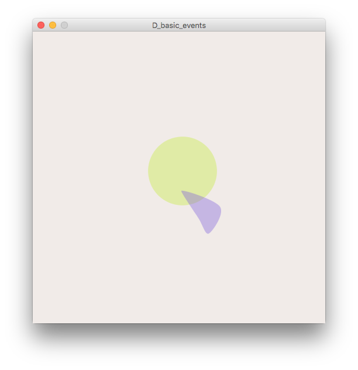

# Organism

Create an "organism" in Processing that will interact and respond to input.

# Examples

## A_basic_motion

Set a function to draw the basic organism at given coordinates. Create movement based on `frameCount` using `sin`.

## B_basic_interaction

## C_basic_interaction_follow

## D_basic_events

## E_leap_motion